# 🚨 Platform Pelaporan Kejahatan Digital Instagram


Platform berbasis web untuk melaporkan dan mengelola kasus kejahatan digital di **Instagram** secara aman dan sistematis.

Aplikasi ini memungkinkan pengguna untuk mengirimkan laporan kejahatan beserta data pribadi dan bukti pendukung. Setiap laporan akan menghasilkan kode pelacakan unik. Administrator dapat mengelola data korban, data kasus, barang bukti, dan memproses tindakan secara bertahap menggunakan kerangka kerja forensik digital **PEC (Preservation, Examination, Collection)** — hingga menghasilkan laporan akhir dalam format PDF.

---

## 📌 Fitur

### 👤 Pengguna (Publik)
- Mengirim laporan kejahatan digital melalui formulir yang mudah digunakan
- Mengisi data pribadi dan deskripsi kasus
- Mengunggah bukti pendukung (screenshot/file — JPG, PNG, PDF, DOC, DOCX hingga 5MB)
- Opsi untuk melaporkan secara **anonim** (identitas disembunyikan)
- Menerima **kode laporan unik** (contoh: `RPT-PE5RISUM`) setelah pengiriman
- Melacak status laporan menggunakan kode laporan melalui admin

### 🛡️ Admin
- Dashboard dengan statistik insiden dan grafik bulanan
- Mengelola data korban/pelapor
- Mengelola data kasus — dengan tampilan aktif dan arsip
- Mengelola catatan barang bukti
- Memproses setiap kasus menggunakan **metode forensik digital PEC** secara bertahap
- Menghasilkan laporan investigasi akhir dalam **format PDF**

---

## 🖼️ Tampilan Aplikasi

### 🏠 Halaman Utama — Form Pelaporan
Halaman publik utama tempat pengguna dapat mengirim laporan dengan mengklik tombol "Laporkan Sekarang".

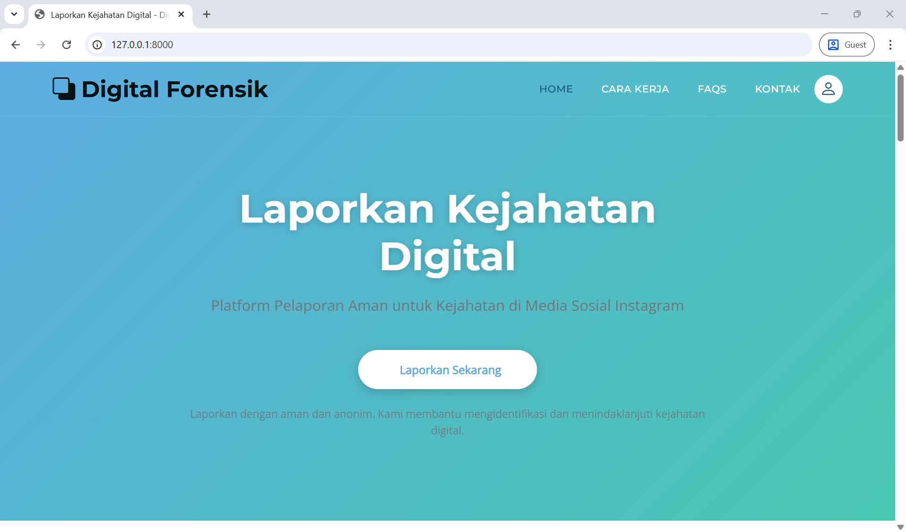

---

### 📋 Form Pelaporan — Lampiran Bukti
Pengguna mengisi formulir laporan yang mencakup informasi pelapor, jenis kejahatan, username/profil pelaku, deskripsi lengkap kejadian, dan mengunggah bukti. Pengguna juga dapat memilih opsi anonim dan wajib menyetujui kebenaran data sebelum mengirim.

**Data yang diisi pelapor meliputi:**
- **Informasi Pelapor:** Nama Lengkap, Email (opsional), No. Telepon (opsional)
- **Detail Laporan:** Jenis Kejahatan (Pelecehan & Cyberbullying / Penipuan & Scam / Konten Berbahaya / Pencurian Identitas / Lainnya), Username/Akun Pelaku, Link Profil Pelaku (opsional), Deskripsi Detail Kejadian (min. 20 karakter)
- **Lampiran Bukti:** Jenis Bukti (Screenshot / Dokumen), Unggah file bukti
- **Opsi Anonim** dan **persetujuan kebenaran data**

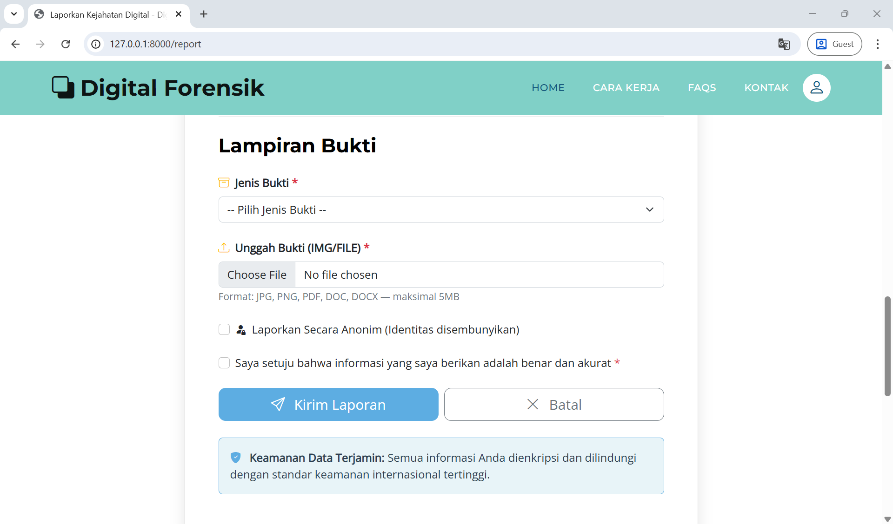

---

### ✅ Laporan Berhasil Dikirim — Kode Unik Pelaporan
Setelah mengirim laporan, pengguna menerima kode referensi laporan unik (contoh: `RPT-PE5RISUM`). Kode ini dapat digunakan untuk menanyakan kepada admin terkait perkembangan laporan.

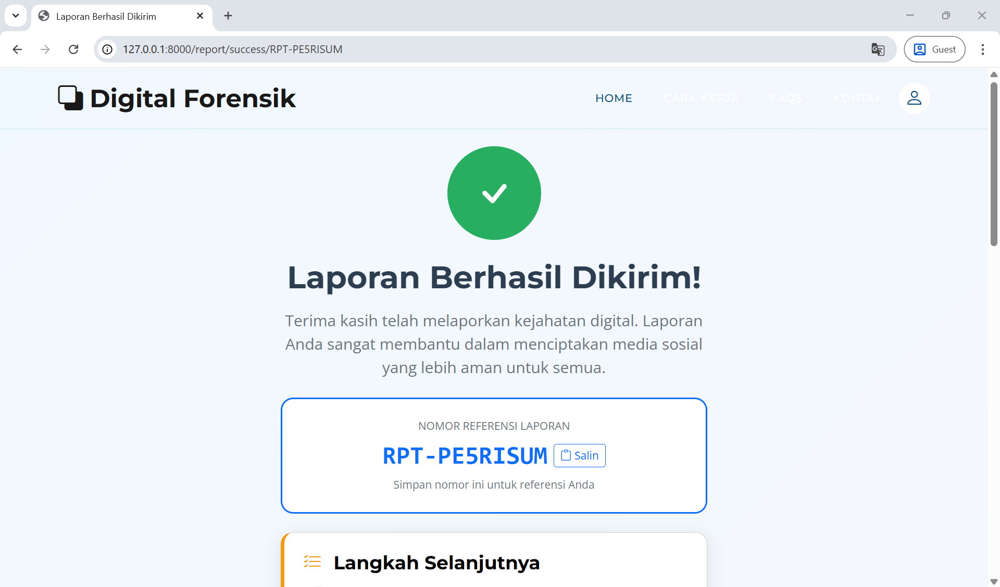

---

### 📊 Dashboard Admin
Dashboard admin menyediakan gambaran umum semua insiden, termasuk total insiden, kasus dalam proses, kasus selesai, dan total pelapor. Ditampilkan juga grafik statistik berdasarkan status dan grafik tren insiden bulanan.

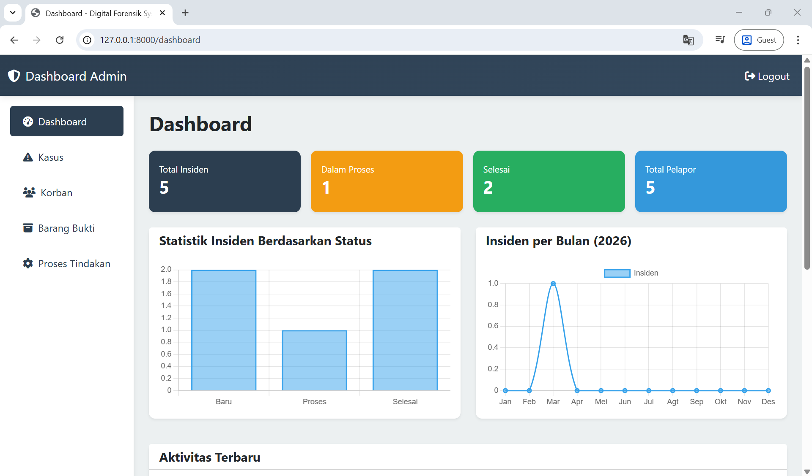

---

### 🗂️ Manajemen Kasus (Kasus Aktif)
Admin dapat melihat dan mengelola semua laporan kasus aktif. Setiap kasus menampilkan ID kasus (contoh: `RPT-2OGZQISH`), jenis kejahatan, korban terkait, tanggal laporan, dan status terkini (Baru / Proses).

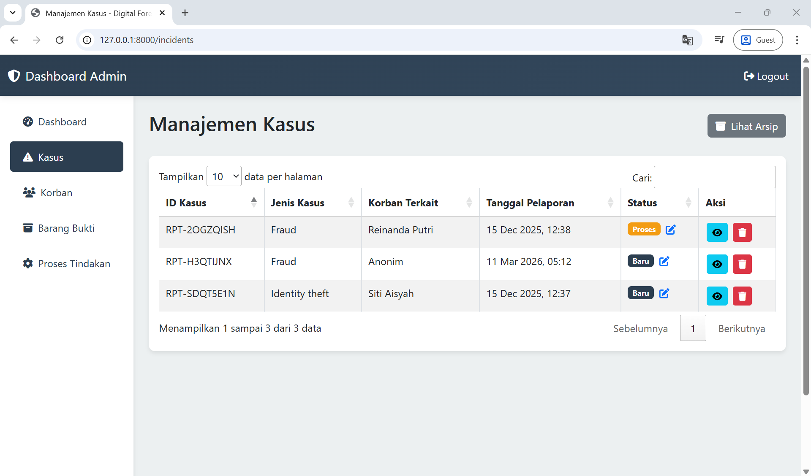

---

### 🗃️ Arsip Kasus
Kasus yang sudah selesai atau ditolak diarsipkan secara terpisah. Kasus dapat memiliki status "Selesai" atau "Ditolak".

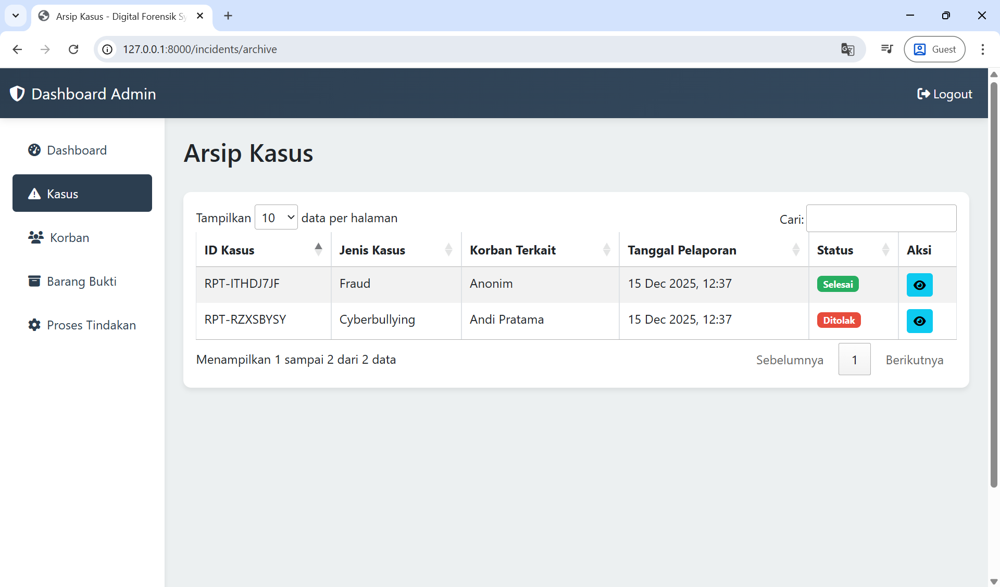

---

### 🔍 Detail Kasus
Admin dapat melihat detail lengkap setiap kasus, termasuk ID kasus, jenis kejahatan, korban terkait, username dan URL profil pelaku yang diduga, tanggal laporan, status, dan deskripsi lengkap kejadian.

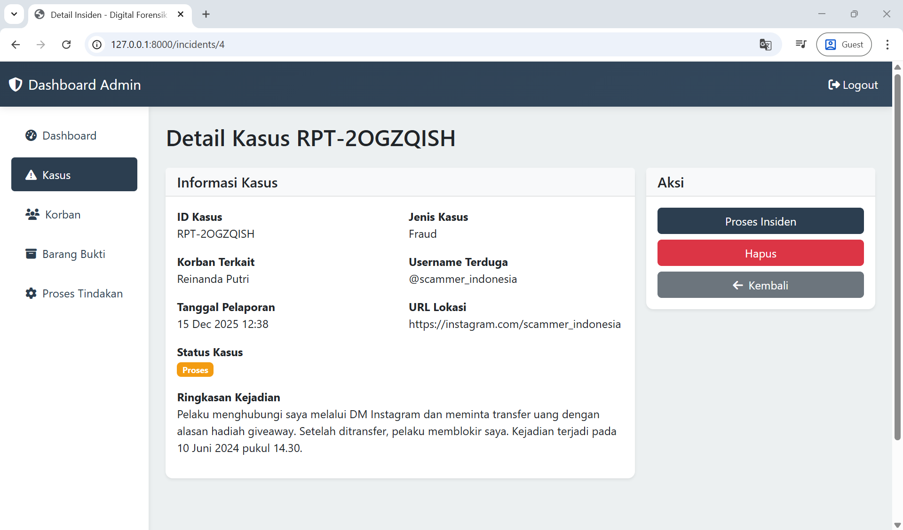

---

### 👥 Data Pelapor (Korban)
Bagian Korban mengelola data pelapor/korban termasuk nama, email, nomor telepon, dan tanggal laporan. Admin dapat mengklik "Cek Kasus" untuk melihat kasus terkait.

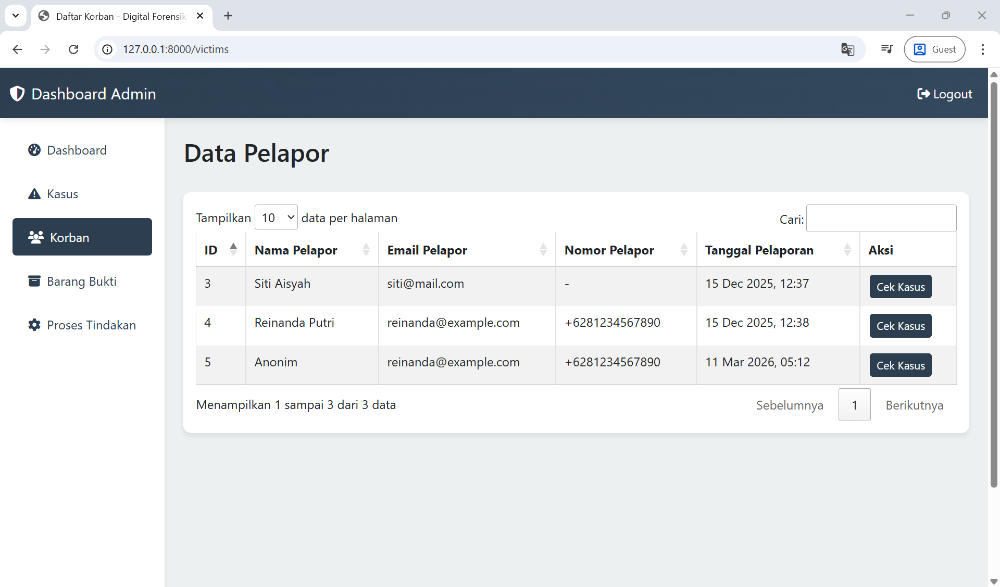

---

### 🗄️ Daftar Barang Bukti
Bagian pengelolaan bukti mencantumkan semua file bukti yang diunggah dan dikaitkan dengan ID kasus masing-masing. Admin dapat melihat file bukti langsung melalui "Lihat Bukti".

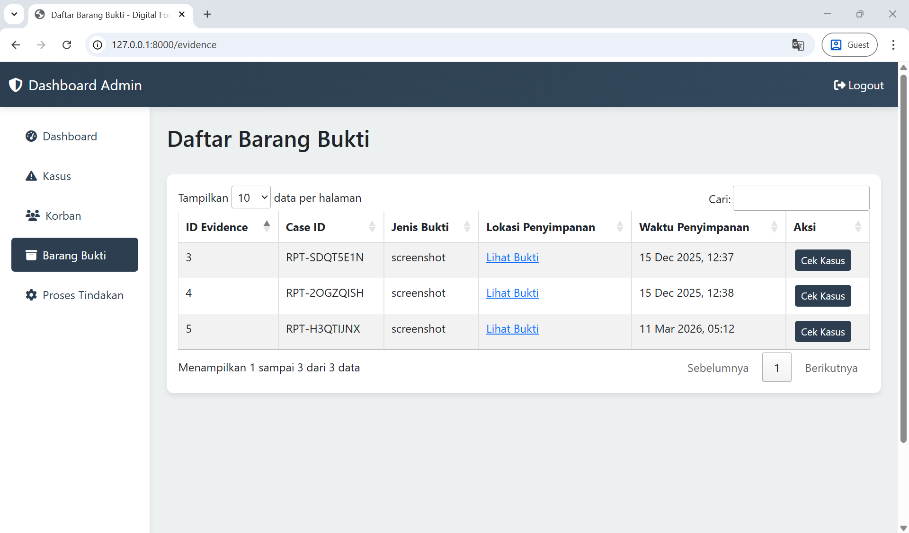

---

### ⚙️ Proses Tindakan — PEC Langkah demi Langkah
Admin memproses setiap kasus menggunakan kerangka kerja forensik digital **PEC (Preservation, Examination, Collection)**, menyelesaikan setiap sub-langkah dan menambahkan catatan sebelum menandainya selesai.

**Tahapan Proses:**

**1. Preservation (Pelestarian Bukti)**
- Simpan screenshot atau file bukti asli tanpa perubahan
- Catat metadata bukti: tanggal unggah, sumber, akun pelaku, tipe file
- Buat hash/checksum untuk setiap file agar bisa dibuktikan tidak diubah

**2. Collection / Acquisition (Pengumpulan Bukti)**
- Kumpulkan info tambahan dari profil pelaku
- Ambil rekaman digital (screenshot, logs, riwayat percakapan)
- Simpan bukti secara terstruktur di server/cloud yang aman

**3. Examination (Pemeriksaan Bukti)**
- Analisis konten bukti untuk menentukan tipe kejahatan
- Periksa konsistensi bukti dengan deskripsi pelapor
- Identifikasi pola atau hubungan dengan kasus serupa

**4. Analisis & Rekomendasi**
- Motif / Tujuan
- Dampak
- Ringkasan & Rekomendasi
- Lampiran Foto / Screenshot Bukti

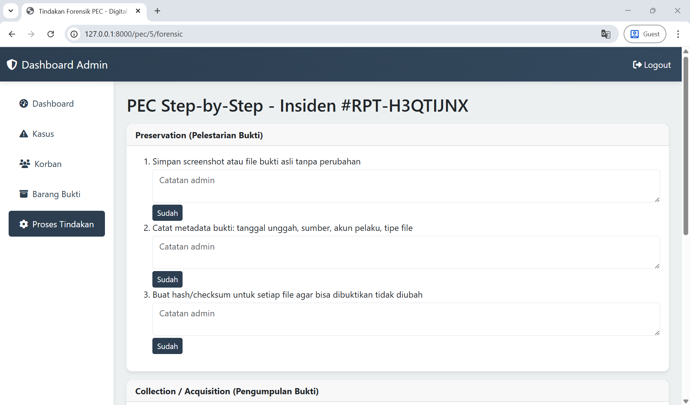

---

### 📄 Laporan Forensik Digital (PDF)
Setelah semua tahapan PEC selesai, admin dapat menghasilkan **Laporan Forensik Digital dalam format PDF**. PDF mencakup informasi pelapor, status insiden, tanggal, semua tahapan PEC, hasil analisis, dan bukti terlampir.

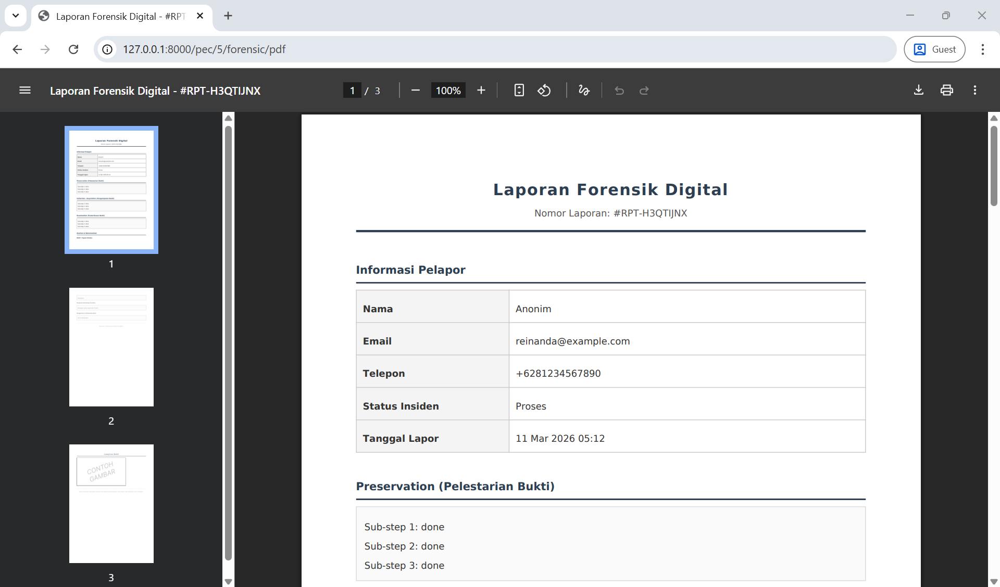

---

## 🔄 Alur Sistem

```
Pengguna mengisi form laporan
        ↓
Sistem menghasilkan Kode Unik 
        ↓
Admin menerima laporan baru di Dashboard
        ↓
Admin memproses dengan metode PEC:
  → Preservation → Collection → Examination
        ↓
Admin mengisi Analisis & Rekomendasi
        ↓
Admin membuat Laporan PDF
        ↓
Status laporan diperbarui (Selesai / Ditolak)
```

---

## 🛠️ Teknologi yang Digunakan

| Lapisan | Teknologi |
|---|---|
| Backend | Laravel (PHP) |
| Frontend | HTML, CSS, JavaScript |
| Basis Data | MySQL |
| Unggah File | Laravel Storage |
| Generator PDF | DomPDF / Laravel PDF |

---

## ⚙️ Cara Instalasi

### 1. Clone Repositori
```bash
git clone https://github.com/adin-alxndr/instagram-digital-crime-reporting-platform
cd instagram-digital-crime-reporting-platform
```

### 2. Instal Dependensi
```bash
composer install
```

### 3. Konfigurasi Environment
```bash
cp .env.example .env
```

Edit file `.env` sesuai konfigurasi basis data Anda:
```env
DB_CONNECTION=mysql
DB_HOST=127.0.0.1
DB_PORT=3306
DB_DATABASE=nama_database_anda
DB_USERNAME=user_db_anda
DB_PASSWORD=password_db_anda
```

### 4. Generate Kunci Aplikasi
```bash
php artisan key:generate
```

---

## 🗃️ Migrasi Basis Data

Jalankan migrasi untuk membuat tabel basis data:
```bash
php artisan migrate
```

Opsional — isi dengan data contoh:
```bash
php artisan db:seed
```

---

## 🗂️ Tautan Storage (untuk unggah file)

```bash
php artisan storage:link
```

---

## ▶️ Menjalankan Server
```bash
php artisan serve
```

Kemudian buka browser Anda:
```
http://127.0.0.1:8000/
```

Dashboard admin dapat diakses di:
```
http://127.0.0.1:8000/dashboard
```
Dengan username 'Admin' dan password '123'

---

## 📜 Lisensi

Proyek ini dikembangkan untuk keperluan edukasi dan portofolio.

---

## 🙋 Pembuat

Dibuat oleh [adin-alxndr](https://github.com/adin-alxndr/) dan [
adeliakhansa](https://github.com/adeliakhansa/)
